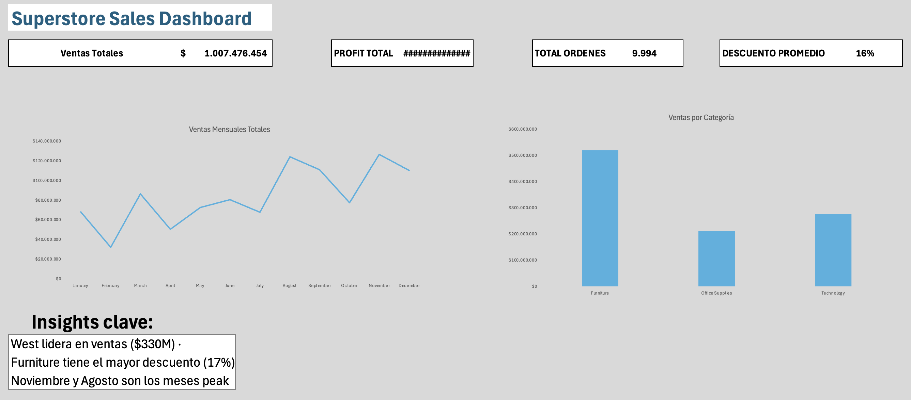

# Superstore Sales Analysis — Excel Dashboard

Análisis completo de ventas retail usando el dataset Sample Superstore (9.994 órdenes, $1M+ en ventas).

---

## Herramientas utilizadas
- **Microsoft Excel** — Power Query, Pivot Tables, SUMIFS, COUNTIFS, AVERAGEIFS, Charts

---

## Estructura del proyecto
| Archivo | Descripción |
|---|---|
| `Superstore_Dashboard_DavidCalderon.xlsx` | Archivo principal con dashboard, métricas y análisis |
| `dashboard.png` | Preview del dashboard ejecutivo |

---

## Proceso de análisis

**Fase 1 — Limpieza de datos (Power Query)**
- Carga y transformación del dataset
- Corrección de tipos de datos (fechas, decimales)
- Creación de columnas auxiliares: Year y Month Name

**Fase 2 — Métricas de negocio (Fórmulas)**
- Ventas totales por Region con SUMIFS
- Margen de ganancia por Category con SUMIFS
- Ticket promedio por Segment con AVERAGEIFS
- Órdenes por Ship Mode con COUNTIFS
- Descuento promedio por Category con AVERAGEIFS

**Fase 3 — Análisis con Tablas Dinámicas**
- Ventas por Category y Region
- Profit por Category y Year
- Estacionalidad: ventas por mes y año
- Slicer interactivo conectado a 3 tablas dinámicas

**Fase 4 — Dashboard ejecutivo**
- 4 KPI cards: Ventas Totales, Profit Total, Total Órdenes, Descuento Promedio
- Gráfico de tendencia mensual
- Gráfico de ventas por categoría

---

## Insights principales

- **West** es la región más rentable con $330M en ventas
- **Furniture** tiene el mayor descuento promedio (17.4%) y el menor margen de ganancia ($58M), lo que explica su baja rentabilidad
- **Technology** es la categoría más rentable con $961M en profit
- **Noviembre y Agosto** son los meses peak de ventas
- **2015** fue el peor año para Furniture con profit negativo (-$6.4M)
- **Standard Class** representa el 59% de los envíos

---

## Autor
**David Calderón** — Ingeniero Civil Informático
